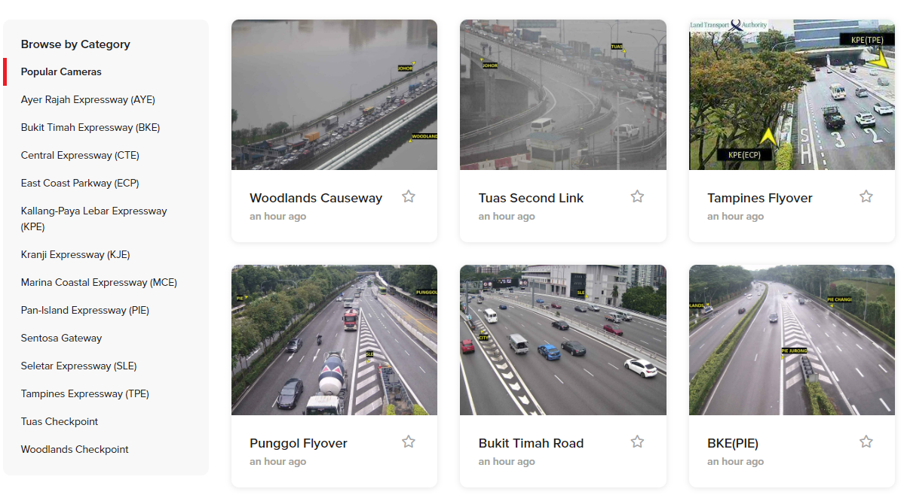

----
Best viewed in dark mode

Please view the [slide deck](https://tinyurl.com/363v3xbr) for a more consolidated explanation of the project.

A demo version (with historical images / traffic counts) of the traffic monitoring app can be viewed [here](https://gilbertsg-sg-traffic-ap-streamlit-traffic-monitoring-app-b6y7xt.streamlit.app/)

----
# Table of Content
- [1. Introduction](#1-introduction)
  * [1.1 Background](#11-background)
  * [1.2 Existing Solutions](#12-existing-solutions)
      - [1.2.1 Static traffic images](#121-static-traffic-images)
      - [1.2.2 Crowd-sourced traffic density estimations](#122-crowd-sourced-traffic-density-estimations)
      - [1.2.3 Traffic monitoring and survey for government](#123-traffic-monitoring-and-survey-for-government)
- [2 Problem Statement](#2-problem-statement)
- [3 Objectives](#3-objectives)
- [4 Project Summary](#4-project-summary)
  * [4.1 Data Acquisition](#41-data-acquisition)
  * [4.2 Vehicle Detection from traffic images](#42-vehicle-detection-from-traffic-images)
    + [4.2.1 Performance and accuracy of image detection](#421-performance-and-accuracy-of-image-detection)
      - [Performance](#performance)
      - [Accuracy](#accuracy)
    + [4.2.2 Known issues and potential improvements](#422-known-issues-and-potential-improvements)
  * [4.3 Time series analysis](#43-time-series-analysis)
    + [4.3.1 Data Processing - Temporal Aggregation](#431-data-processing---temporal-aggregation)
    + [4.3.2 Weekly Seasonality over the Month](#432-weekly-seasonality-over-the-month)
    + [4.3.3 Daily Seasonality over the Week](#433-daily-seasonality-over-the-week)
    + [4.3.4 Trend over the whole island](#434-trend-over-the-whole-island)
  * [4.4 Time series forecasting](#44-time-series-forecasting)
    + [4.4.1 Seasonal Decomposition](#441-seasonal-decomposition)
    + [4.4.2 Train-Test Split](#442-train-test-split)
    + [4.4.3 Modelling](#443-modelling)
    + [4.4.4 Model evaluation](#444-model-evaluation)
    + [4.4.5 Prophet model interpretation](#445-prophet-model-interpretation)
    + [4.4.6 Effect of Forecast Horizon](#446-effect-of-forecast-horizon)
  * [4.5 Deployment](#45-deployment)
- [5 Future Works / Potential Improvements](#5-future-works---potential-improvements)

----
# 1. Introduction

## 1.1 Background
There are nearly 1 million motor vehicles [[1]](https://data.gov.sg/dataset/annual-motor-vehicle-population-by-vehicle-type?view_id=6aca1157-ea79-4e39-9e58-3e5313a9a715&resource_id=dec53407-9f97-47b8-ba89-b2070569a09e) on Singapore's road network of more than 9,500 lane-kilometers which constitutes around 12% of the total Singapore Land Area [[2]](https://www.lta.gov.sg/content/ltagov/en/who_we_are/our_work/road.html#:~:text=Singapore's%20road%20network%20connects%20all,km%20of%20roads%20and%20expressways). Despite the high proportion of land being used for roads, Singapore still ranks 88th out of 405 cities in the World with the highest traffic congestion in peak hours [[3]](https://www.tomtom.com/traffic-index/ranking/). This puts Singapore a couple of spots above Sydney (rank 97) and not too far below Bangkok (rank 74). Singapore roads have an average congestion level of 29%[[4]](https://www.tomtom.com/traffic-index/singapore-traffic/#), which is defined as the ratio of how much longer drivers spend on their commute during peak hours compared to non-peak hours. Singaporean commuters on avarage wastes about 105 additional hours per year when driving in rush hour.

Therefore, it is critical for drivers and commuters to be able to monitor the current traffic conditions, as well as get a prediction on when the conditions are ideal for travel. This will then enable road users to decide on the best time and route for their travel. 

## 1.2 Existing Solutions
#### 1.2.1 Static traffic images
Road users typically use various traffic monitoring apps and websites in order to plan their travel and attempt to beat the traffic. To assess the current traffic conditions, commuters usually rely on several websites which display a static image of traffic cameras (e.g.: [[5]](https://onemotoring.lta.gov.sg/content/onemotoring/home/driving/traffic_information/traffic-cameras/bke.html#trafficCameras), [[6]](https://www.motorist.sg/traffic-cameras), [[7]](https://www.trafficiti.com/)) which are obtained from the same traffic cameras provided by the Land Transport Authority (LTA) Datamall API [[8]](https://datamall.lta.gov.sg/content/datamall/en/dynamic-data.html). 

The static images provided by these websites means that users would have to estimate the amount of cars present in the image and guess the curent traffic conditions based on a single static image. Furthermore, these websites typically do not provide historical/previous traffic images, making it difficult for users to assess the current traffic condition in the context of the overall traffic condition. Ultimately, since neither vehicle count nor historical data is provided, users would not be able to obtain a reasonable forecast of traffic conditions using these websites

#### 1.2.2 Crowd-sourced traffic density estimations
An alternative for the traffic images websites are the apps and websites which provides crowd-sourced traffic density estimations, such as Google Maps or Apple Maps. Other than being used for navigation purposes, some of these apps are able to display the current traffic conditions based on crowd-sourced informations (i.e.: getting data from fellow app users). 

However, these type of crowd-sourced information could not achieve the level of accuracy of actual sensors and traffic measurements. Furthermore, they are vulnerable to malicious attacks such as when someone used 99 iPhones to create a cluster of "traffic jams" in Berlin's Road [[9]](https://www.youtube.com/watch?v=k5eL_al_m7Q).

With a recent update, Google maps is now able to display 'typical' traffic conditions based on historical crowd-sourced traffic data. This provides users a very basic estimate/forecast of future traffic conditions based on the average weekly traffic information. However, as we shall discover later in this project, the so-called 'naive seasonal' prediction based on past week's data does not provide the best accuracy compared to other more sophisticated models.

Finally, the level of detail / granularity of information for the traffic condition provided by Google Maps is highly lacking, by only providing users with a 4-level color-coded information regarding the traffic condition, going from low to high. While this level of granularity should be sufficient for road users who are planning their commute, it might not be sufficient for the purposes of a long-term traffic monitoring / survey for government agencies for the purposes of transportation planning. 

#### 1.2.3 Traffic monitoring and survey for government
Government agencies typically employ a multitude of sensors and techniques in order to conduct traffic counting for monitoring and survey purposes. These techniques range from manual counting or using radar-based sensors, which are highly labour-intensive or have high equipment cost, respectively. As such, using traffic counts from traffic cameras could be a highly efficient solution with relatively low costs compared to the alternative, especially for preliminary survey prior to employing other more accurate but more costly solutions.

----

# 2 Problem Statement
The goal of this project will be to develop an app for **detecting, monitoring, and predicting the vehicle count** in various stretches of highways in Singapore. This will enable users to rapidly assess the **historical, current, and future traffic condition** in order to make their commuting decision.

The same app can also be deployed by government agencies for the purpose of **vehicle count monitoring** over a period of time, in order to drive regulatory decisions with regards to transporatation planning in Singapore. 

----
# 3 Objectives
The goal of this project are as follows:
- Apply computer vision and deep learning techniques to extract real-time traffic count from traffic camera images
- Apply time series analysis and modelling to obtain prediction / forecast of future traffic count
- Build a data pipeline for downloading, traffic counting, and traffic predictions for various camera instances in Singapore's highway
- Architect a database solution for storing processed and unprocessed traffic camera images, as well as traffic counts and traffic forecasts 
- Develop a traffic monitoring app for traffic monitoring, displaying historical data as well as future predictions of traffic conditions

----
# 4 Project Summary
The various steps taken in this project is as follows:
1. Scraping of image links and traffic images from data.gov.sg traffic images API (notebooks 1a, 1b)
2. Vehicle detection and counting using a pre-trained YOLOv7 model using OpenCV2 (notebook 2)
    - Object detection done using a pre-trained darknet implementation of YOLOv7
    - Image masking is done to isolate the region of interest in the traffic images
3. Time series analysis on the vehicle counts obtained from the previous step (notebook 3a)
    - Explore data aggregation methods (i.e.: aggregating traffic count by 30 minutes)
    - Exploratory data analysis on the seasonal patterns of vehicle counts of the different cameras
    - Obtained descriptive statistics regarding the vehicle counts of the different cameras
4. Time series modelling for generating predictions and forecast of future vehicle counts (notebook 3b)
    - Investigate the model that yielded the best prediction for a 7-day prediction window
    - Assess the accuracy of the model with and without retraining
    - Assess the accuracy of the model with different prediction windows
5. Develop and productionize the code required for continuous download and detection of traffic images (notebook 4a)
6. Develop the front-end application for displaying the traffic count information and forecasts (notebook 4b)

----
## 4.1 Data Acquisition
- Traffic images from 87 locations throughout Singapore's expressways are provided by LTA Datamall
- Images are updated every 1 - 5 minutes

The following are several example of the traffic images:

For this study, we downloaded the traffic images from selected cameras (22) for the entire month of October, as well as the first two weeks of November. The cameras are selected based on varying locations, spanning all across Singapore.

The total number of images downloaded for this study is 195,093 images.

----
## 4.2 Vehicle Detection from traffic images
The process of the vehicle detection and counting can be graphically summarized as follows:

1. First the input image is loaded from the image database
2. Next the image is masked in order to only keep the region of interest (ROI) for the image detection model to work on
3. Use YOLOv7 with OpenCV2 to detect all the instance of vehicles in the masked image
4. Add back the masked out parts of the image for storing and display to end users

### 4.2.1 Performance and accuracy of image detection

#### Performance
The image detection process was conducted on a **AMD Ryzen 5900X laptop CPU** (detection with GPU currently not supported with the pip version of Python OpenCV2). Using the CPU, we were able to achieve a pre-processing and detection speed of about **1.0 to 1.4 frames second**

#### Accuracy
Using the pretrained YOLOv7 DNN model, we were able to detect majority of the vehicles in the region of interest, in both daytime and night conditions:

However, for a more quantitative measure of detection accuracy, we would need to manually label the traffic images and compare the number of vehicles detected against the ground truth. Due to time constraint manual labelling of images is outside the scope of this project.

### 4.2.2 Known issues and potential improvements
Despite having reasonable accuracy in detecting vehicles there are several instances of detection error, such as those shown below:

These issues can potentially be solved by the following:
- Custom training the YOLOv7 model to detect:
    - Smaller instances of vehicles (the original COCO dataset may not contain vehicles from far away)
    - Vehicles during night-time (especially vehicles which are occluded by its own headlights/taillights)
- Fine tuning of YOLOv7 detection confidence threshold
- Improvement on traffic cameras for detection during the rain, such as:
    - Proper rain cover for traffic cameras, or
    - Use of hydrophobic lens coating which eliminates or reduces water droplets on the camera lens
    - Use of higher sensitivity / ISO cameras for nighttime detection in order to reduce shutter speed and motion blur

----
## 4.3 Time series analysis
### 4.3.1 Data Processing - Temporal Aggregation

We can see that the raw data is very noisy and there are inconsistencies between the frequency of the camera detection (see the dataframe head). As such, we will use a temporal aggregation in order to smooth out the data.

### 4.3.2 Weekly Seasonality over the Month

The figure above shows the weekly pattern of the vehicle count. There are significantly lower traffic (about 70% lower) on the weekends (Saturday and Sunday) compared to on weekdays (Monday to Friday).

We can also observe the effect of a public holiday (Diwali on 24/10/2022), where the traffic is more similar to a typical weekend traffic.

### 4.3.3 Daily Seasonality over the Week

The figure above shows that there are not that not that much difference in vehicle counts between the different weeks in the month. This implies that there is a fairly constant weekly seasonality over the month. We can then obtain the average traffic based on the day-of-week. More importantly, this also means that the vehicle count over the months are stationary, that is they do not trend either upwards or downwards.

We can now average the four weeks to get the general daily seasonality over the week:

### 4.3.4 Trend over the whole island
In the previous examples, we have used the vehicle count from a single camera (camera 4708 at AYE) to plot the vehicle count graphs. 

We can also aggregate the trafic count data from all 22 cameras and obtain the following combined traffic density graph:

Additionally, we can also plot the heatmap of traffic density at different hours and day-of-week:

Based on the heatmap, the following observations can be made:
- There are very low traffic flow between 10pm - 6am
- Highest traffic are in morning and evening rush hours
- Highest overall traffic is on Friday evening rush hour

----
## 4.4 Time series forecasting

### 4.4.1 Seasonal Decomposition
For the time series modeling of vehicle counts we'll be using various models to predict the vehicle count forecast. Most of these models work by breaking down the observation into a trend component and a seasonal component.

As such, we will observe these trend and seasonal component by conducting a seasonal decomposition.

The figure above shows the seasonal decomposition of vehicle count time series. The following observations can be made:
- There are clear weekly seasonality in the observation
- The trend component it's relatively minor compare to the seasonal component (+/- 0.5 for trend vs +/- 5)
- The traffic count data is fairly noisy, as indicated by the high residual components

Additional ADF test conducted on the dataset has also indicated stationarity (p-value = 1.208631e-27)

### 4.4.2 Train-Test Split
In this study, we will use the first 5 weeks of traffic data to predict the next 1 week

### 4.4.3 Modelling
We used 6 different models to generate the forecast for the trafic counts. Here is a graphical summary of the model performance:

### 4.4.4 Model evaluation
The following graph shows the root mean squared error (RMSE) of the 6 models:

RMSE is chosen as the accuracy metrics here because it is not sensitive to zero values / predictions, and it penalizes large deviations (suitable for traffic predictions)

Based on the graph above, the best model is the Prophet Model, which is:
- 54% better than Naive Mean model
- 11% better than Naive Seasonal model

### 4.4.5 Prophet model interpretation
As previously mentioend, the FB Prophet model uses the training data in order to infer the trend and various seasonal components of the timeseries.

As such, to interpret the model, we can take a look at the magnitude of the different seasonal components predicted by the prophet model.

We can see from the figure above that the model with the highest effect on the model is the two custom seasonality modes, which are the Weekly (30m) and Daily (30m).

These two modes have a seasonality period of 1\*48 and 7\*48, respectively. These correspond to the number of 30 minutes interval in a day and in a week.

The other seasonal components, which are the standard daily and weekly components have effects that are an order of magnitude lower than the custom components. Similarly, the trend component is also very low compared to any of the seasonal components

### 4.4.6 Effect of Forecast Horizon
When deploying the model into production, we have the choice of the frequency in which we will be generating the model (e.g.: generate weekly prediction for the next week, or generate daily prediction for the next day)

In this section, we will take a look at the effect of different forecast horizon on the accuracy of the model.

To do this, we will conduct a backtest using the prophet model, where the model is repeatedly trained and tested according to the forecast horizon. The backtesting period used is between 17 October to 15 November.

Only about 6% difference in prediction accuracy between 7 days and 1 day forecast horizon, hence we will use a forecast horizon of 7 days for deployment.

----
## 4.5 Deployment
The deployment of the traffic monitoring app is done in two parts:
- Back-end / data pipeline to download and process traffic images, as well as generating predictions, and
- Front-end to display the traffic images, vehicle count history, and the prediction

Here is a diagram of the app architecture:

The front-end will contain the following:
- Inputs for the camera_id, as well as the date and time to be called
- Display the annotated traffic image
- A map showing current traffic level, and
- A graph containing the current, historical, and forecast traffic count

Here is a screenshot of the front-end app:

A demo version (with historical images / traffic counts) of the traffic monitoring app can be viewed [here](https://gilbertsg-sg-traffic-ap-streamlit-traffic-monitoring-app-b6y7xt.streamlit.app/)

Currently the online deployment of the app only includes the front-end aspect of the app. For future work, it would be possible to deploy the whole pipeline to the cloud using Amazon Sagemaker.

----
# 5 Future Works / Potential Improvements
- Conduct quantitative accuracy measure on the vehicle detection algorithm (requires manual labelling)
- Improve on vehicle detection accuracy by doing the following:
    - Custom training the YOLOv7 model to detect:
        - Smaller instances of vehicles (the original COCO dataset may not contain vehicles from far away)
        - Vehicles during night-time (especially vehicles which are occluded by its own headlights/taillights)
    - Fine tuning of YOLOv7 detection confidence threshold
    - Improvement on traffic cameras for detection during the rain, such as:
        - Proper rain cover for traffic cameras, or
        - Use of hydrophobic lens coating which eliminates or reduces water droplets on the camera lens
        - Use of higher sensitivity / ISO cameras for nighttime detection in order to reduce shutter speed and motion blur
- Enable GPU for vehicle detection
- Cloud deployment using Amazon Sagemaker
